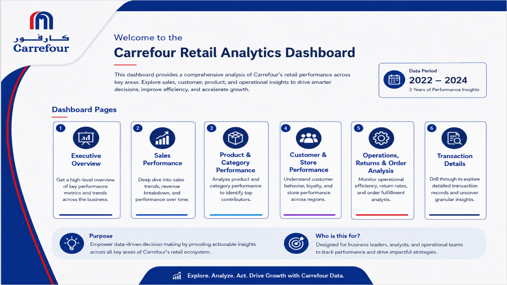
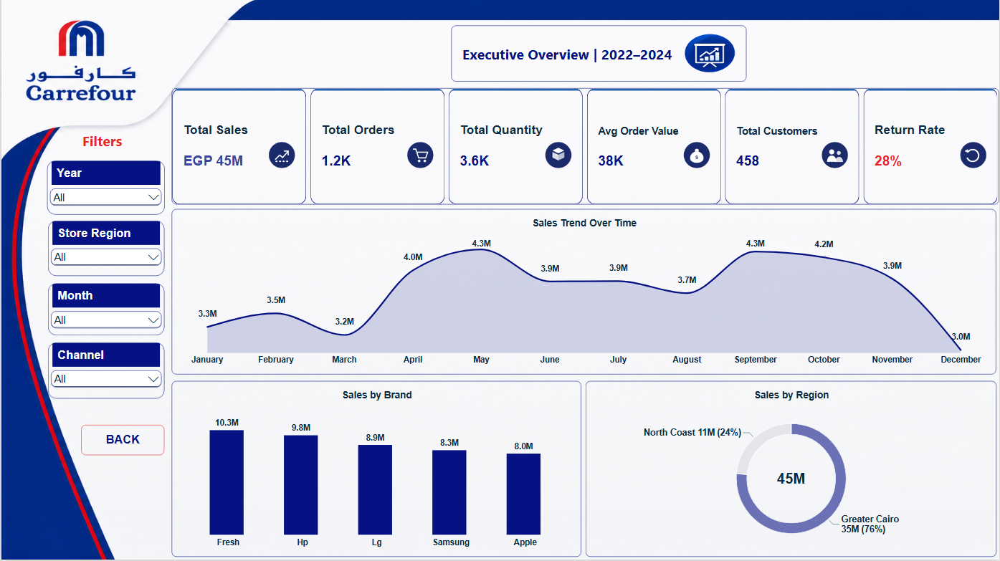
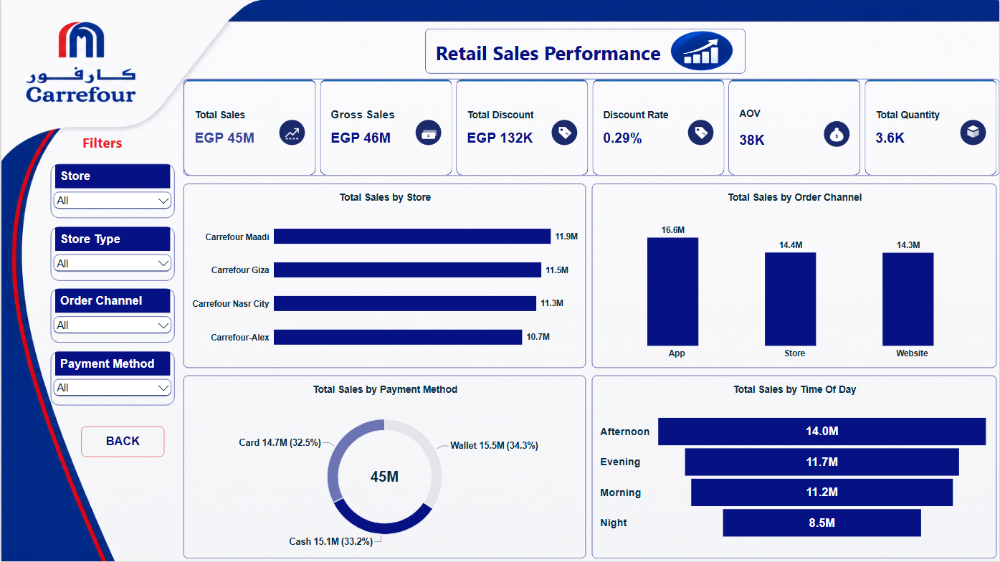
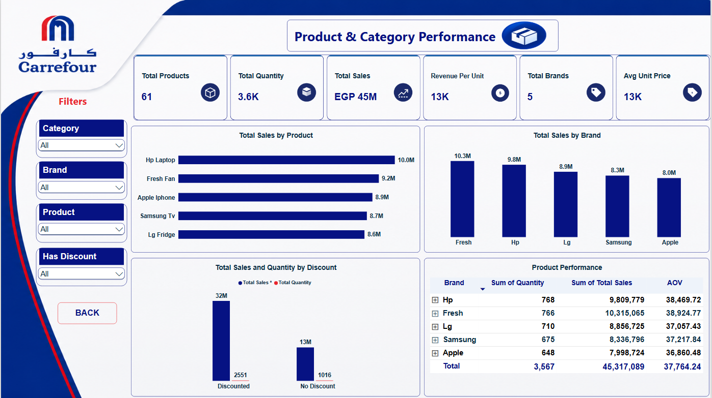
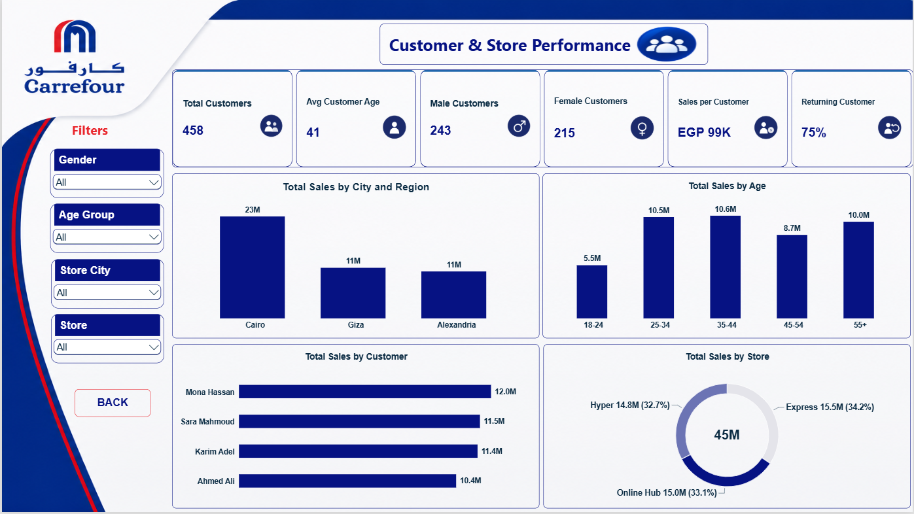
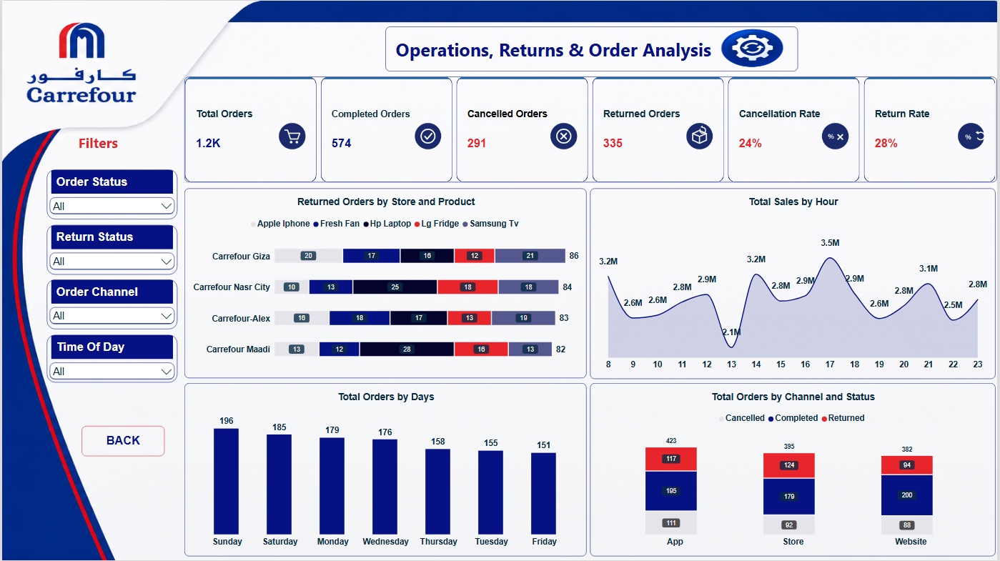
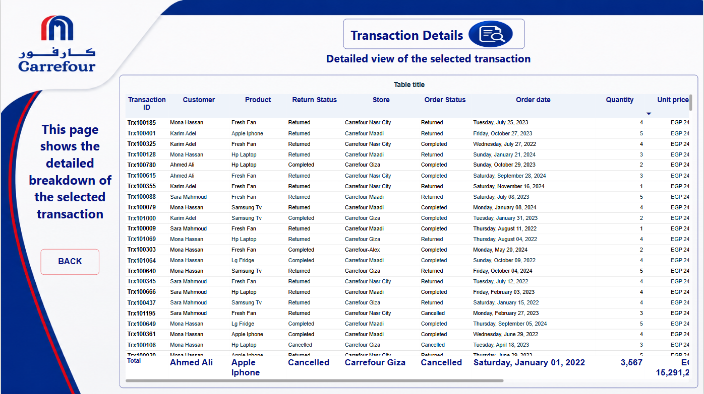

# Carrefour Retail Analytics Dashboard | Power BI

An end-to-end retail analytics solution built in Power BI on three years of Carrefour Egypt sales data (2022–2024). The report turns raw transactional records into an executive-ready, six-page interactive dashboard covering sales, products, customers, store operations and returns.

<p align="center">
  
</p>

---

## Table of Contents

- [Overview](#overview)
- [Business Questions](#business-questions)
- [Dataset](#dataset)
- [Tech Stack](#tech-stack)
- [Data Preparation & Modeling](#data-preparation--modeling)
- [Dashboard Pages](#dashboard-pages)
- [Key DAX Measures](#key-dax-measures)
- [Key Insights](#key-insights)
- [Design & UX](#design--ux)
- [Repository Structure](#repository-structure)
- [How to Use](#how-to-use)
- [Author](#author)

---

## Overview

Retail decision-makers rarely need more data — they need the right view of it. This project takes a raw Carrefour transactional dataset and delivers a single, navigable report that answers questions at three levels:

| Level | Audience | Pages |
|---|---|---|
| Strategic | Business leaders | Executive Overview |
| Tactical | Category, sales & store managers | Sales Performance · Product & Category · Customer & Store |
| Operational | Operations & fulfilment teams | Operations, Returns & Orders · Transaction Details |

Every page shares a consistent layout — a KPI band on top, four analytical visuals beneath, and a dedicated filter panel on the left — so users learn the interface once and apply it everywhere.

**Reporting period:** January 2022 – December 2024 (3 years)
**Currency:** EGP

---

## Business Questions

The report was designed around a defined set of questions:

1. How is total revenue trending over time, and which months drive peaks and troughs?
2. Which stores, regions and cities contribute the most revenue?
3. Which order channels (App / Store / Website), payment methods and times of day dominate sales?
4. Which brands and products are the top revenue contributors, and what is their revenue per unit?
5. What is the real impact of discounting on sales volume and value?
6. Who are the customers — by age, gender and loyalty — and what is their value per head?
7. How healthy is order fulfilment? What are the cancellation and return rates, and where are returns concentrated?
8. Can a user drill from any aggregate figure down to the individual transaction behind it?

---

## Dataset

A retail transactions dataset of roughly **1.2K orders** spanning 2022–2024.

| Dimension | Values |
|---|---|
| Stores | Carrefour Maadi, Carrefour Giza, Carrefour Nasr City, Carrefour Alexandria |
| Store types | Hypermarket, Express, Online Hub |
| Cities / Regions | Cairo, Giza, Alexandria — grouped into Greater Cairo & North Coast |
| Brands | HP, Fresh, LG, Samsung, Apple (5 brands, 61 products) |
| Order channels | App, Store, Website |
| Payment methods | Cash, Card, Wallet |
| Customers | 458 unique customers, with age group and gender attributes |

**Core fields:** Transaction ID · Customer · Product · Brand · Category · Store · Store Type · Store City · Store Region · Order Channel · Payment Method · Order Date · Time of Day · Quantity · Unit Price · Discount · Order Status · Return Flag

---

## Tech Stack

| Tool | Role |
|---|---|
| **Power BI Desktop** | Data modeling, DAX, report design |
| **Power Query (M)** | Data cleaning, transformation, conditional logic |
| **DAX** | KPIs, rates, ratios and time-based measures |
| **SQL Server (SSMS)** | Source database and exploratory queries |
| **Excel** | Initial data profiling |
| **SVG / PNG assets** | 22 custom-built KPI icons and branded page backgrounds |

---

## Data Preparation & Modeling

Data quality work made up the largest share of the effort. The main issues resolved:

**1. Conflicting order status vs. return flag**
Around **26% of rows** carried logically inconsistent combinations between `Order Status` and `Return Flag` (for example, a cancelled order marked as returned). A custom column was built in Power Query using M `if / then / else` logic to derive a single, trustworthy status field, preventing double-counting in the return and cancellation metrics.

**2. Inconsistent store regions**
`Store Region` values were standardised against a proper Egyptian geographic mapping so that each city rolls up to the correct region (Greater Cairo, North Coast).

**3. Category and product naming**
`Product Category` values were normalised through value replacement, eliminating duplicate categories caused by casing and spelling variations.

**4. Typing and formatting**
Date, numeric and text columns were explicitly typed; a dedicated date table supports time-based analysis; unit price and discount fields were cast to currency for correct aggregation.

**5. Discount logic validation**
The weighted discount calculation was rebuilt using `DIVIDE(SUM(...), SUM(...))` to avoid division-by-zero errors and to produce a true value-weighted discount rate rather than a misleading average of percentages.

---

## Dashboard Pages

### 1 · Home / Navigation


A branded landing page introducing the report, the data period and the purpose of each page, with buttons routing users to any section.

### 2 · Executive Overview


High-level health check: Total Sales, Total Orders, Total Quantity, Average Order Value, Total Customers and Return Rate, supported by a monthly sales trend, sales by brand, and a regional revenue split.
*Filters: Year · Store Region · Month · Channel*

### 3 · Retail Sales Performance


Revenue decomposition: gross vs. net sales, total discount and discount rate, AOV and quantity, broken down by store, order channel, payment method and time of day.
*Filters: Store · Store Type · Order Channel · Payment Method*

### 4 · Product & Category Performance


Portfolio view: top products and brands by revenue, revenue per unit, average unit price, discounted vs. non-discounted performance, and a matrix ranking brands by quantity, revenue and AOV.
*Filters: Category · Brand · Product · Has Discount*

### 5 · Customer & Store Performance


Customer demographics and value: customer count, average age, gender split, sales per customer and returning-customer rate, with revenue by city, age band, top customers and store type.
*Filters: Gender · Age Group · Store City · Store*

### 6 · Operations, Returns & Order Analysis


Fulfilment and quality: completed, cancelled and returned orders with their respective rates, returned orders by store and product, hourly sales curve, order volume by weekday, and channel performance by order status.
*Filters: Order Status · Return Status · Order Channel · Time of Day*

### 7 · Transaction Details (Drill-through)


A drill-through destination reachable from any visual, exposing the individual transactions behind a selected data point — transaction ID, customer, product, store, order and return status, date, quantity and unit price — with conditional formatting highlighting returned and cancelled records.

---

## Key DAX Measures

```dax
Total Sales =
SUMX ( Orders, Orders[Quantity] * Orders[Unit Price] * ( 1 - Orders[Discount] ) )

Gross Sales =
SUMX ( Orders, Orders[Quantity] * Orders[Unit Price] )

Total Discount = [Gross Sales] - [Total Sales]

Discount Rate = DIVIDE ( [Total Discount], [Gross Sales], 0 )

Avg Order Value = DIVIDE ( [Total Sales], [Total Orders], 0 )

Return Rate = DIVIDE ( [Returned Orders], [Total Orders], 0 )

Cancellation Rate = DIVIDE ( [Cancelled Orders], [Total Orders], 0 )

Returning Customer % =
DIVIDE (
    CALCULATE ( DISTINCTCOUNT ( Orders[Customer ID] ), Orders[Order Count] > 1 ),
    [Total Customers],
    0
)

Sales per Customer = DIVIDE ( [Total Sales], [Total Customers], 0 )
```

Filtered measures use `CALCULATE` with `&&` for multi-condition logic, and every ratio is wrapped in `DIVIDE` with an explicit alternate result to keep the report clean when slicers return empty selections.

---

## Key Insights

- **EGP 45M in net revenue** across 2022–2024, from ~1.2K orders and 3.6K units, at an average order value of ~EGP 38K.
- **Revenue is highly concentrated geographically** — Greater Cairo accounts for 76% of total sales versus 24% for the North Coast, and Cairo alone generates roughly twice the revenue of Giza or Alexandria.
- **Sales are seasonal**, peaking in May and September (EGP 4.3M each) and bottoming out in December (EGP 3.0M) — a pattern worth aligning stock and staffing to.
- **Brand performance is tight**: the gap between the strongest brand (Fresh, EGP 10.3M) and the weakest (Apple, EGP 8.0M) is only ~22%, so no single brand carries the business.
- **Discounting drives volume disproportionately**: discounted items account for EGP 32M of revenue and 2,551 units versus EGP 13M and 1,016 units for non-discounted — yet the overall discount rate is just 0.29%, indicating narrow but well-targeted promotions.
- **Channels are evenly balanced** (App EGP 16.6M, Store EGP 14.4M, Website EGP 14.3M), as are payment methods (Wallet 34.3%, Cash 33.2%, Card 32.5%) — a genuinely omnichannel customer base.
- **Operational risk is the headline finding**: a 28% return rate and 24% cancellation rate mean only 574 of 1.2K orders complete cleanly. Returns are spread evenly across all four stores (82–86 each), pointing to a product- or process-level cause rather than a single underperforming branch.
- **Customer loyalty is strong** — 75% returning customers at EGP 99K of revenue per customer, with the 25–44 age band as the core segment.

---

## Design & UX

- **Custom branded theme** built on the Carrefour navy, red and white palette, applied consistently across all pages.
- **22 hand-built KPI icons** produced as SVG and exported to PNG, so every card carries a purpose-built visual rather than a generic stock shape.
- **Custom page backgrounds** designed to hold the logo, filter panel and content zones in a fixed grid.
- **Consistent interaction model**: a left-hand filter rail on every page, a persistent navigation button, and bookmarked page routing.
- **Drill-through** from any aggregate to the underlying transactions.
- **Conditional formatting** on risk metrics (return rate, cancellation rate) so negative signals are visible at a glance.
- **Scatter/detail overplotting** resolved through proper aggregation, keeping dense visuals readable.

---

## Repository Structure

```
Carrefour_Retail_Analytics/
├── README.md
├── LICENSE
├── .gitattributes
├── carrefour-retail-analytics-dashboard.pbix   # Power BI report file
├── carrrefour dataset.xlsx                     # Source dataset
└── Asset/
    ├── 01-home.png
    ├── 02-executive-overview.png
    ├── 03-sales-performance.png
    ├── 04-product-category.png
    ├── 05-customer-store.png
    ├── 06-operations-returns.png
    └── 07-transaction-details.png
```

---

## How to Use

1. Install **Power BI Desktop** (latest version recommended).
2. Clone the repository:
   ```bash
   git clone https://github.com/emanelshafei18-byte/Carrefour_Retail_Analytics.git
   ```
3. Open `carrefour-retail-analytics-dashboard.pbix`.
4. If the source path prompts, update it via **Transform data → Data source settings** to point at `carrrefour dataset.xlsx` (or your SQL Server instance).
5. Click **Refresh**, then start from the Home page and navigate through the report.

> **Tip:** right-click any visual element and choose **Drill through → Transaction Details** to inspect the records behind it.

---

## Author

**Eman Elshafei**
Data Analyst | Accounting graduate specialising in Data Analysis
Power BI · Power Query (M) · DAX · SQL · Python · Excel · Tableau · Looker Studio

Linked In : [LinkedIn](https://www.linkedin.com/in/eman-elshafei)

---

<sub>This project uses a synthetic dataset built for analytics practice. It is not affiliated with, endorsed by, or representative of Carrefour; the brand name and logo are used for educational demonstration purposes only.</sub>
